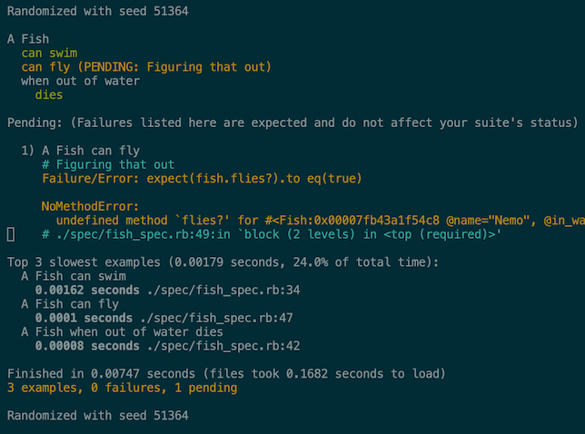

class: center, middle

# Intro to RSpec 3


???
* welcome
* talk about what specs are
* setting up and running tests
* organizing tests (sharing)
* expectations

---
class: middle, center
## So what is it?

RSpec is a behaviorial-driven style testing framework for ruby.

Facilitate writing tests in a language that is easily understood.

Help describe how code should behave, and not how it's implemented.

---

## Anatomy of a Spec
``` ruby
RSpec.describe 'A Fish', :fast do
  let(:fish) { Fish.new('Nemo') }

  it 'can swim' do
    expect(fish).to be_swims
  end

  context 'when out of water' do
    before { fish.in_water = false }

    it 'dies' do
      expect(fish).to be_dead
    end
  end

  it 'can fly' do
    pending 'Figuring that out'
    expect(fish.flies?).to eq(true)
  end
end
```

---
## What happens when I run it?



---
## Running Specs

There are several ways.

1) Using the command line:

``` shell
rspec spec/unit/a_spec.rb

rspec -e "A Fish"

rspec --profile 2

rspec --only-failures

rspec --tag fast
```

2) Through Bundler (`bundle exec rspec`) or Rake (`rake spec`)

3) Check your favorite editor!

---
## Hooks
For setting up / tearing down tests.

``` ruby
  before { Fish.new }

  after(:context) do
    puts 'Yay!'
  end
```

Hooks with `:each` or `:example` args run for every test.

`:all` or `:context` run for for every test group.

You can also set up hooks for the entire test suite.

``` ruby
  RSpec.configure do |config|
    config.around(:example, :db) do |example|
      DB.transaction(rollback: :always) { example.run }
    end
  end
```

---
## Helpers

`let` and `let!` are memoized helper methods that are cached for every test but not across tests.

You can also define your own helpers.

``` ruby
  module JsonHelpers
    def json_response
      @json_response ||= JSON.parse(last_response.body)
    end
  end
```

and import them into your own tests

``` ruby
  RSpec.describe 'GET /api/products', type: :request do
    include JsonHelpers

    # some tests
  end
```
---
class: middle, center

# Organizing Specs

---
## Configuration

It's ~~all~~ mostly in `spec/support/*`

Default configuration lives in `spec/spec_helper.rb`

Example:
``` ruby
  RSpec.configure do |config|
    config.include Factory::Girl::Syntax::Methods

    config.filter_run :focus
    config.run_all_when_everything_filtered = true

    config.profile_examples = 10

    config.order = :random
  end
```

---
## Sharing Tests

``` ruby
  RSpec.shared_examples 'a paginated route' do
    it 'has metadata' do
      get '/api/products?page=2'
      body = JSON.parse(last_response.body)
      expect(body['metadata']['pagination']).to include(:next_page)
    end
  end

  RSpec.describe 'GET /api/products', type: :request do
    it_behaves_like 'a paginated route'

    # some more tests
  end
```

---
## Sharing Setup Code

``` ruby
  RSpec.shared_context 'authenticated' do |group|
    include Request::AuthenticationHelpers

    before do
      user = FactoryGirl.create(:user, group)
      auth_with_header(user)
    end
  end

  RSpec.describe 'POST /api/users/ban', type: :request do
    include_context 'authenticated', :team_member
  end
```

---
class: middle, center

# EXPECTATIONS!
---
## Expectation

Used to specify expected outcomes.

Consists of:

1) A __subject__ - the thing we're testing

2) A __matcher__ - specifies what's true about the subject

3) And optionally a failure message

Example:
``` ruby
expect(listings.count).to eq(5), 'not enough stuff'
```

---
## Primitive Matchers

when you want to check if 2 things are the same.

``` ruby
  expect(1.even?).to be false

  expect(3).not_to eql(2)

  expect(1).to be < 2

  expect(fish).to be_swims

  expect(3.1).to be_within(0.1).of(Math::PI)

  expect('mango').to start_with('m')

  expect(:foo).to statisfy { |value| value.is_a?(Symbol) }
```

---
## Higher-Order Matchers

when you want to compose different matchers.

``` ruby
  expect(a: 'foo', b: 'bar').to include(:a)

  expect([2, 4, 6]).to all be_even

  expect(['mango', 'smoothie']).to start_with(
    a_string_ending_with('go')
  ).and end_with(
    a_string_starting_with('sm')
  )
```

---
# Block Matchers

when you want to run some code, throw an error, check `stdout`.

``` ruby
  expect do
    nil.length
  end.to raise_error(NoMethodError)

  array = [5, 4, 3]
  expect { array.append(2) }.to change { array.length }.by(1)

  expect { print 'Hello' }.to output('Hello').to_stdout
```

---
# Custom Matchers

when all else is lost.

``` ruby
  RSpec::Matchers.define :a_named_fish  do |name|
    match do |fish|
     fish.is_a?(Fish) && fish.name === name
    end
  end

  RSpec::Matchers.alias_matcher :be_a_fish_named, :a_named_fish

  expect(fish).to be_a_fish_named('Nemo')
```

---
class: middle, center

# RSpec and Rails

---
## Types of Specs supported by rspec-rails

* **:feature** - tests the entire app, including UI

* **:request** - API tests, all the layers

* **:model** - tests ActiveRecord models

* **:controller** - tests controllers in isolation, skips middleware

* There's also, **:view**, **:helper**, **:mailer**, and much more!


Also adds new matchers like:
* `have_http_status(404)`

* `redirect_to('https://www.register-grailed.com')`

---
class: middle, center

# I'm out of slides
